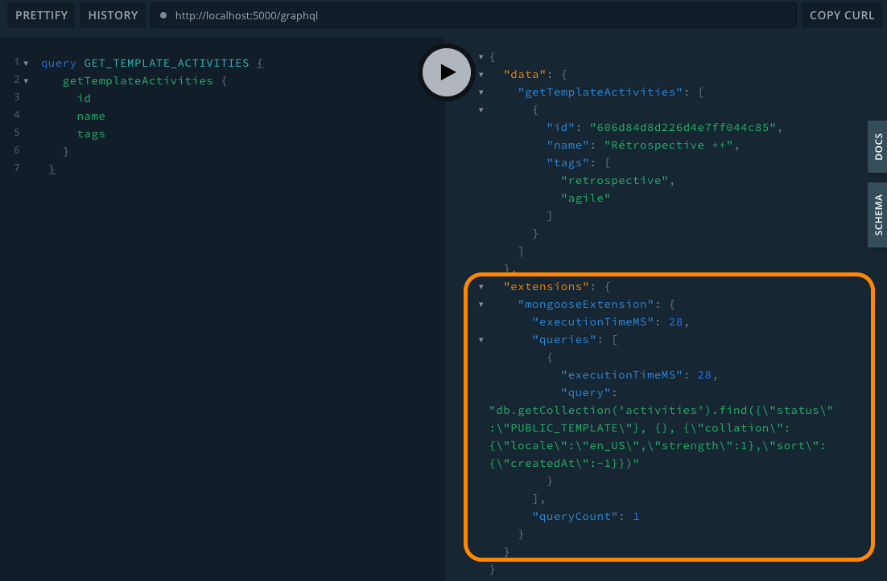

# Apollo Mongoose Plugin


[Apollo GraphQL plugin](https://www.apollographql.com/docs/apollo-server/integrations/plugins/) to add Mongodb query information on the `extensions` node.

You will have access to the queries executed by Mongoose and execution times directly from the GraphQL response as bellow:



## Installation

If you’re using npm:

```bash
npm install apollo-mongoose-plugin
```

With yarn:

```bash
yarn add apollo-mongoose-plugin
```

## Usage

Adding the `apollo-mongoose-plugin` plugin to your project is done in 2 steps:

1. **register the mongoose query collector plugin:** _it will add hooks to collect and measure execution times of your queries._
2. **register the apollo plugin:** _it will use the previous query collector to return queries on the GraphQL response._

```typescript
import {
  ApolloMongoosePlugin,
  mongoCollectorPlugin,
} from 'apollo-mongoose-plugin';
import { ApolloServer } from 'apollo-server';
import mongoose from 'mongoose';

// first: register mongoose query collector plugin
// 🔔  Make sure you are registering the mongoose plugin
//     before you are creating mongoose models
mongoose.plugin(mongoCollectorPlugin);

// then: register apollo plugin
const server = new ApolloServer({
  // ...schema, dataSources
  plugins: [new ApolloMongoosePlugin()],
});
```

🚨 &nbsp; Be aware that it is best not to activate this plugin in production. For example, you can do this:

```typescript
if (process.env.NODE_ENV !== 'production')
  mongoose.plugin(mongoCollectorPlugin);

const server = new ApolloServer({
  // ...schema, dataSources
  plugins: [
    process.env.NODE_ENV !== 'production' && new ApolloMongoosePlugin(),
  ].filter(Boolean),
});
```

## API

### `ApolloMongoosePlugin`

This is the core plugin, that you register with Apollo Server.

#### Options

| Name               | Default                              | Description                                                                                                           |
| ------------------ | ------------------------------------ | --------------------------------------------------------------------------------------------------------------------- |
| `formatMongoQuery` | `formatMongoQueryAsString`           | Function called to format queries in the GraphQL response. You can create your own by implementing `FormatMongoQuery` |
| `mongoCollector`   | `MongooQueryCollector.getInstance()` | Instance of mongoose query collector                                                                                  |

## Contributing

You want to help? That’s awesome!

Check out the details of our [contribution process](./CONTRIBUTING.md) (it’s fairly standard).

## License and copyright

This library is © [Samuel Kauffmann](http://github.com/skauffmann) and is MIT licensed. See [LICENSE.md](./LICENSE.md) for details.
